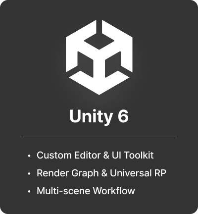
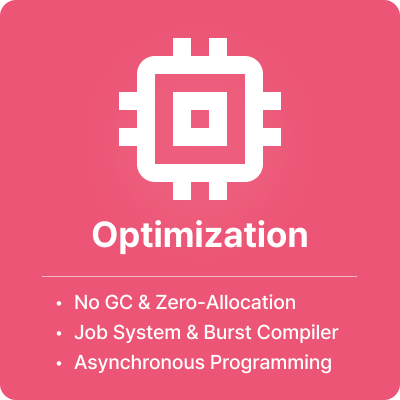
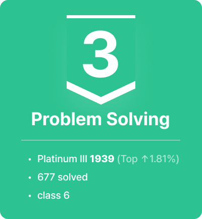

<!-- markdownlint-disable MD033 -->
<!-- markdownlint-disable-next-line MD041 -->

## About me

- 👋 Hi, I'm Seungbin Jo
- 🎓 Senior CS student at Sejong University
- 🕹️ Dedicated Unity Game Developer
- 🎨 Digital artist and gamer during free time
- ✍️ Archiving technical insights on my [blog](https://blog.naver.com/onion-dev)

## Currently Learning & Exploring

    
    
    

## Projects

## Log (Since 2025-01)

## Contact

- Email: seungbin0619@naver.com
- Discord: .448aff
- Blog: [Onion Dev (Naver)](https://blog.naver.com/onion-dev)
